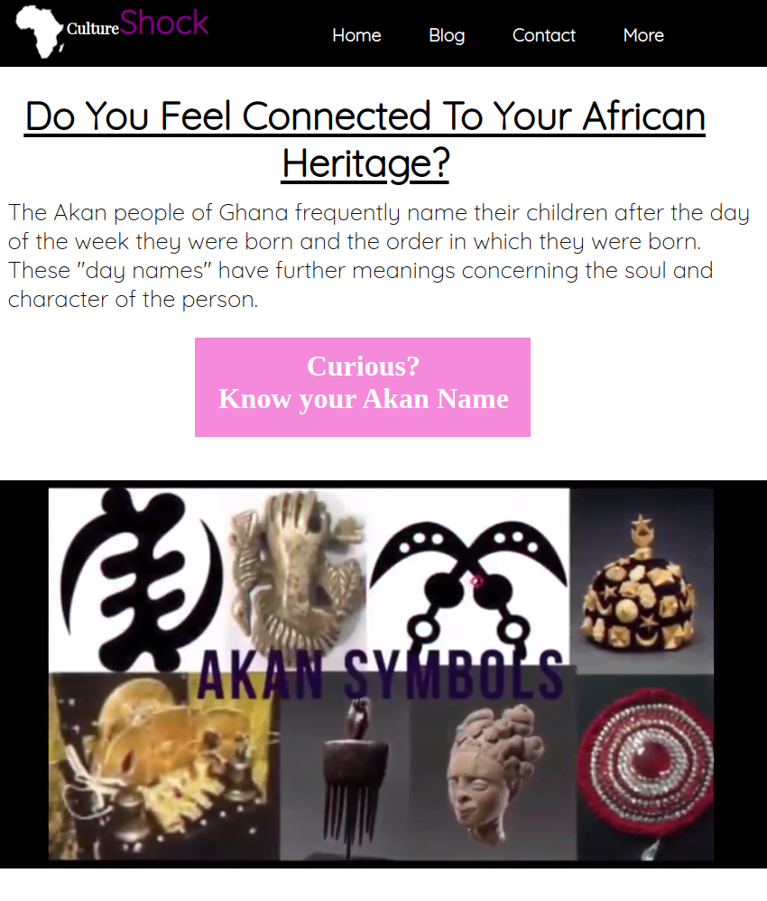

# Culture_Shock

#### By Wendy Nina

## Table of Content

+ [Description](#description)
+ [Installation Requirement](#Installation)
+ [Technology Used](#technology-used)
+ [Reference](#reference)
+ [License](#license)
+ [Authors Info](#author-Info)

## Description
This is is a simple website that takes user's birthday and gender as input then calculates the day of the week they were born in order to output their Akan name with reference to the day of the week.

### Requirements
-Either a computer,phone,tablet or an Ipad

-Make sure you have access to internet

-Click on the live link in the about section

-Make sure to fill in all details.

[Go Back to the top](#Culture_Shock)

### Installation Process
## Technology Used
HTML - which was used to build the structure of the pages.

CSS - which was used to style the pages.

Vanilla JS - which was used to add functionality to the form.

## Reference
(https://developer.mozilla.org/en-US/docs/Web/JavaScript/Reference)

[Go Back to the top](#Culture_Shock)

# License
Copyright (c) 2022 [click to view License](LICENSE)

## Authors Info
Linked In-[Wendy Nina]
(https://www.linkedin.com/in/wendy-nina-616559196/)

CodeWars-(https://www.codewars.com/users/the@rt_Coder)

##### Link to live site
[Go Back to the top](#Culture_Shock)